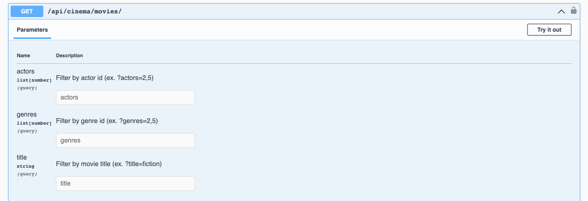

# Cinema API

API service for cinema management written on DRF


```shell
git clone https://github.com/MaybeTI/Cinema-api.git
python -m venv venv
venv\Scripts\activate (on Windows)
source venv/bin/activate (on macOS)
pip install -r requirements.txt
export DB_HOST=DB_HOST
export DB_NAME=DB_NAME
export DB_USER=DB_USER
export DB_PASSWORD=DB_PASSWORD
export SECRET_KEY=SECRET_KEY
python manage.py migrate
python manage.py runserver
```

## Run with docker

Docker should be installed

```shell
docker-compose build
docker-compose up
```

## Getting access

- create user /api/user/register/
- get access token /api/user/token/

# Endpoints


Filter for movie_ sessions

Filter for movies

Filter for orders


# Features

- JWT authenticated
- Admin panel /admin/
- Documentation is located at /api/doc/swagger/
- Managing orders and tickets
- Creating movies with genres, actors
- Creating cinema halls
- Adding movie sessions
- Filtering movies and movie sessions
